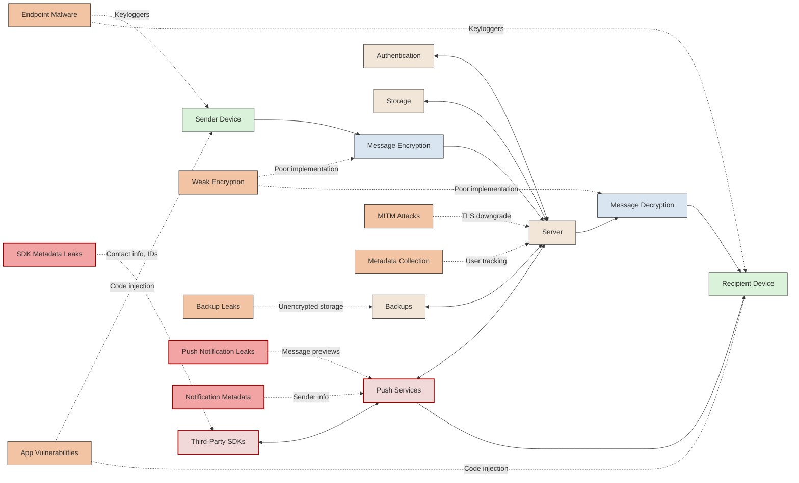

```mermaid
flowchart LR
    %% Main messaging flow
    A[Sender Device] --> B[Message Encryption] --> C[Server] --> D[Message Decryption] --> E[Recipient Device]
    
    %% Infrastructure components
    F[Authentication] <--> C
    G[Storage] <--> C
    H[Backups] <--> C
    I[Push Services] <--> C
    I --> E
    J[Third-Party SDKs] <--> I
    
    %% Core vulnerabilities
    V1[Endpoint Malware] -.->|"Keyloggers"| A & E
    V2[App Vulnerabilities] -.->|"Code injection"| A & E
    V3[Weak Encryption] -.->|"Poor implementation"| B & D
    V4[MITM Attacks] -.->|"TLS downgrade"| C
    V5[Metadata Collection] -.->|"User tracking"| C
    V6[Backup Leaks] -.->|"Unencrypted storage"| H
    
    %% Push notification vulnerabilities
    V7[Push Notification Leaks] -.->|"Message previews"| I
    V8[SDK Metadata Leaks] -.->|"Contact info, IDs"| J
    V9[Notification Metadata] -.->|"Sender info"| I
    
    %% Styling
    classDef device fill:#d9f2d9,stroke:#333
    classDef process fill:#d9e6f2,stroke:#333
    classDef infrastructure fill:#f2e6d9,stroke:#333
    classDef pushServices fill:#f2d9d9,stroke:#900,stroke-width:2px
    classDef vulnerability fill:#f2c4a3,stroke:#333
    classDef pushVulnerability fill:#f2a3a3,stroke:#900,stroke-width:2px
    
    class A,E device
    class B,D process
    class C,F,G,H infrastructure
    class I,J pushServices
    class V1,V2,V3,V4,V5,V6 vulnerability
    class V7,V8,V9 pushVulnerability
```
