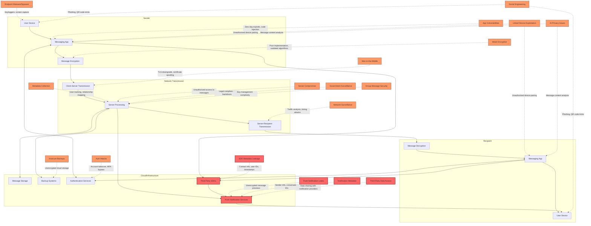

```mermaid
flowchart TB
    subgraph "Sender"
        A1[User Device] --> A2[Messaging App]
        A2 --> A3[Message Encryption]
    end
    
    subgraph "Network Transmission"
        A3 --> B1[Client-Server Transmission]
        B1 --> B2[Server Processing]
        B2 --> B3[Server-Recipient Transmission]
    end
    
    subgraph "Recipient"
        B3 --> C1[Message Decryption]
        C1 --> C2[Messaging App]
        C2 --> C3[User Device]
    end
    
    subgraph "Cloud/Infrastructure"
        D1[Message Storage]
        D2[Backup Systems]
        D3[Authentication Services]
        D4[Push Notification Services]
        D5[Third-Party SDKs]
        B2 <--> D1
        B2 <--> D2
        A2 <--> D3
        C2 <--> D3
        B2 --> D4
        D4 --> C3
        A2 --> D5
        C2 --> D5
        D5 --> D4
    end
    
    %% Vulnerabilities
    V1[Endpoint Malware/Spyware] -.->|"Keyloggers, screen capture"| A1
    V2[App Vulnerabilities] -.->|"Zero-day exploits, code injection"| A2
    V3[Weak Encryption] -.->|"Poor implementation, outdated algorithms"| A3
    V4[Man-in-the-Middle] -.->|"TLS downgrade, certificate spoofing"| B1
    V5[Metadata Collection] -.->|"User tracking, relationship mapping"| B2
    V6[Server Compromise] -.->|"Unauthorized access to messages"| B2
    V7[Network Surveillance] -.->|"Traffic analysis, timing attacks"| B3
    V8[Social Engineering] -.->|"Phishing, QR code tricks"| A1
    V8 -.->|"Phishing, QR code tricks"| C3
    V9[Linked Device Exploitation] -.->|"Unauthorized device pairing"| A2
    V9 -.->|"Unauthorized device pairing"| C2
    V10[Insecure Backups] -.->|"Unencrypted cloud storage"| D2
    V11[Auth Attacks] -.->|"Account takeover, MFA bypass"| D3
    V12[Push Notification Leaks] -.->|"Unencrypted message previews"| D4
    V13[Government Surveillance] -.->|"Legal compliance backdoors"| B2
    V14[Group Message Security] -.->|"Key management complexity"| B2
    V15[AI Privacy Issues] -.->|"Message content analysis"| A2
    V15 -.->|"Message content analysis"| C2
    V16[SDK Metadata Leakage] -.->|"Contact info, user IDs, timestamps"| D5
    V17[Notification Metadata] -.->|"Sender info, conversation IDs"| D4
    V18[Third-Party Data Access] -.->|"Data sharing with notification providers"| D4

    classDef vulnerability fill:#f96,stroke:#333,stroke-width:1px
    class V1,V2,V3,V4,V5,V6,V7,V8,V9,V10,V11,V12,V13,V14,V15,V16,V17,V18 vulnerability
    
    classDef emphasis fill:#f66,stroke:#900,stroke-width:2px
    class D4,D5,V12,V16,V17,V18 emphasis
```
